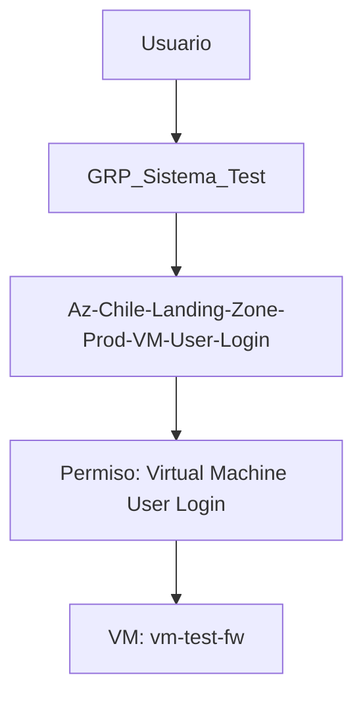

# 🛡️ Asignación de Acceso Bastion a una Virtual Machine en Azure

## 📖 Introducción

La finalidad de este documento es guiar paso a paso el proceso de asignación y control de acceso mediante **Azure Bastion** hacia una Virtual Machine (VM) en Microsoft Azure.

Azure Bastion es un servicio que proporciona conectividad RDP/SSH segura a las VMs directamente desde el portal de Azure, sin necesidad de exponer puertos públicos (como el 3389 o el 22) ni de utilizar una VPN.

Este proceso garantiza que el acceso a las VMs se realice de forma segura y auditada, siguiendo las mejores prácticas de **Principio de Mínimo Privilegio** y **Segregación de Funciones**.

---

## 📋 Prerrequisitos

Antes de comenzar, asegúrese de contar con los siguientes elementos:

| Recurso | Descripción |
| :--- | :--- |
| **Acceso al Portal de Azure** | Cuenta con permisos suficientes para gestionar grupos de seguridad y asignaciones de roles. |
| **Azure Bastion** | El servicio Bastion debe estar implementado y configurado en la red virtual (VNet) donde se encuentra la VM. |
| **Azure Active Directory (AAD)** | Los usuarios que necesitan acceso deben existir en AAD. |

---

## 📝 Paso a Paso

### **Step 1: Obtener el Nombre del Grupo de Recursos de la VM**

1.  Acceda al **Portal de Azure** (`https://portal.azure.com`).
2.  En el menú de búsqueda, escriba y seleccione el servicio **Virtual Machines**.

3.  Filtre la VM a la que desea asignar el rol de Bastion. Para este ejemplo, utilizaremos la VM `vm-test-fw`.

4.  En la página de la VM, localice y anote el nombre del **Grupo de Recursos** (Resource Group) al que pertenece.
    > **Ejemplo:** Para la VM `vm-test-fw`, el grupo de recursos es `rg-test-prod-eastus-01`.

---

### **Step 2: Validar la Existencia de los Roles en Azure Active Directory**

Un pre-requisito fundamental es que exista un grupo en Azure Active Directory (AAD) que contenga a los usuarios que necesitarán acceder a la VM.

1.  En el Portal de Azure, busque y seleccione el servicio **Azure Active Directory**.

2.  En el menú de la izquierda, seleccione **Grupos**.

3.  Filtre y verifique la existencia de los siguientes grupos de seguridad:

| Identificador | Grupo | Descripción | Obligatorio |
| :--- | :--- | :--- | :---: |
| **a)** | `GRP_Sistema_Test` | Contiene los usuarios que poseerán acceso a la VM a través de Bastion. | ✅ Sí |
| **b)** | `Az-Chile-Landing-Zone-Prod-VM-User-Login` | Grupo de seguridad global para acceso a VMs en la Landing Zone. | ✅ Sí |
| **c)** | `Az-rg-test-prod-eastus-VM-User-Login` | Grupo de seguridad específico para el Grupo de Recursos de la VM. | ⚠️ Si no existe, se creará en el siguiente paso. |

El grupo **a)** (`GRP_Sistema_Test`) debe existir si o si, de no existir, debe deberá ser solicitado a Operaciones la creación de este grupo que posee los usuarios que poseerán los accesos a la Virtual machine por Bastión.

El grupo **b)** (`Az-Chile-Landing-Zone-Prod-VM-User-Login`) debe existir si o si, de no existir, debe cancelar la asignación de Bastión, dado que no existe el grupo necesarios para continuar con esta asignación. Por lo cual, deberá regularizar o aclarecer como corregir el nombre del grupo que se asignará.

El grupo **c)** (`Az-rg-test-prod-eastus-VM-User-Login`), si NO existe, esta correcto y se deberá crear en los step’s siguientes.

---

### **Step 3: Crear el Grupo de Seguridad Específico para la VM**

Este grupo de seguridad se asigna directamente al rol `Virtual Machine User Login` sobre el Grupo de Recursos.

1.  Vaya a **Azure Active Directory** > **Grupos**.
2.  Seleccione **Nuevo grupo**.
3.  Configure el grupo con los siguientes parámetros:

| Parámetro | Valor (Ejemplo) | Descripción |
| :--- | :--- | :--- |
| **Tipo de grupo** | `Seguridad` | Tipo de grupo para gestionar permisos. |
| **Nombre del grupo** | `Az-rg-test-prod-eastus-VM-User-Login` | <ul><li>**Formato:** `Az-<nombre_recurso_sin_01>-VM-User-Login`</li><li>**Ejemplo:** `Az-rg-test-prod-eastus-VM-User-Login`</li></ul> |
| **Descripción del grupo** | `Grupo Acceso Bastión VM Az-rg-test-prod-eastus-VM-User-Login` | Descripción clara del propósito del grupo. |
| **Miembros** | `GRP_Sistema_Test` | Asignar el grupo de usuarios que obtendrá acceso. |

4.  Haga clic en **Crear**.
5.  Verifique que el grupo se haya creado correctamente filtrándolo en la lista de grupos.

---

### **Step 4: Asignar el Grupo de Usuarios al Grupo de Seguridad Global**

Este paso anida el grupo de usuarios (`GRP_Sistema_Test`) dentro del grupo de seguridad global (`Az-Chile-Landing-Zone-Prod-VM-User-Login`).

1.  Vaya a **Azure Active Directory** > **Grupos**.
2.  Filtre y seleccione el grupo **`Az-Chile-Landing-Zone-Prod-VM-User-Login`**.
3.  En el menú de la izquierda, seleccione **Miembros**.
4.  Seleccione **Agregar miembros**.
5.  Busque y seleccione el grupo **`GRP_Sistema_Test`**.
6.  Haga clic en **Seleccionar** para añadirlo como miembro.
7.  Actualice la lista de miembros para verificar que el grupo `GRP_Sistema_Test` se haya añadido correctamente.

---

### **Step 5: Asignar el Rol de "Virtual Machine User Login" a la VM**

Finalmente, se asigna el rol `Virtual Machine User Login` al grupo de seguridad específico de la VM sobre el Grupo de Recursos que la contiene.

1.  Vaya al servicio **Virtual Machines** y seleccione la VM `vm-test-fw`.
2.  En el menú de la izquierda, seleccione **Control de acceso (IAM)**.
3.  Seleccione **Agregar** > **Agregar asignación de roles**.
4.  En la pestaña **Rol**:
    *   Busque y seleccione el rol **`Virtual Machine User Login`**.
    *   Haga clic en **Siguiente**.

    > **Nota:** El rol `Virtual Machine User Login` permite a los usuarios autenticarse en la VM (por ejemplo, para una conexión RDP o SSH).

5.  En la pestaña **Miembros**:
    *   Haga clic en **Seleccionar miembros**.
    *   Busque y seleccione el grupo de seguridad creado en el Step 3: **`Az-rg-test-prod-eastus-VM-User-Login`**.
    *   Haga clic en **Seleccionar**.

6.  Haga clic en **Revisar y asignar** para completar la asignación del rol.

---

## ✅ Verificación del Acceso

1.  Vaya al portal de Azure y seleccione la VM `vm-test-fw`.
2.  En el menú superior, haga clic en **Conectar** > **Bastion**.
3.  Se abrirá una nueva pestaña o ventana con el cliente RDP o SSH. Debería poder autenticarse sin problemas si el usuario está en el grupo `GRP_Sistema_Test`.

---

## 📚 Glosario de Términos

| Término | Definición |
| :--- | :--- |
| **Azure Active Directory (AAD)** | Servicio de identidad y acceso basado en la nube de Microsoft. |
| **Azure Bastion** | Servicio que permite conexiones RDP/SSH seguras a VMs sin exponer puertos públicos. |
| **Grupo de Seguridad** | Contenedor lógico en Azure AD para gestionar permisos de acceso a recursos. |
| **Grupo de Recursos (Resource Group)** | Contenedor lógico en Azure donde se agrupan y gestionan recursos. |
| **IAM (Identity and Access Management)** | Control de acceso basado en roles (RBAC) de Azure. |
| **Rol Virtual Machine User Login** | Rol que permite a un usuario autenticarse en una VM (sin permisos administrativos). |
| **Mínimo Privilegio (Least Privilege)** | Principio de seguridad que otorga solo los permisos necesarios para realizar una tarea. |
| **Segregación de Funciones** | Principio que separa responsabilidades para reducir el riesgo de errores o fraudes. |

---
Mario Fribla
***Ingeniero Cloud***

